### [1. Sistema operatiu](sistema-operatiu.md)

El primer que farem serà crear una màquina virtual Ubuntu 24 des de VirtualBox i començar la instal·lació.

Per a començar dins de virtual box el que farem serà entrar amb virtual box i seleccionar nova 
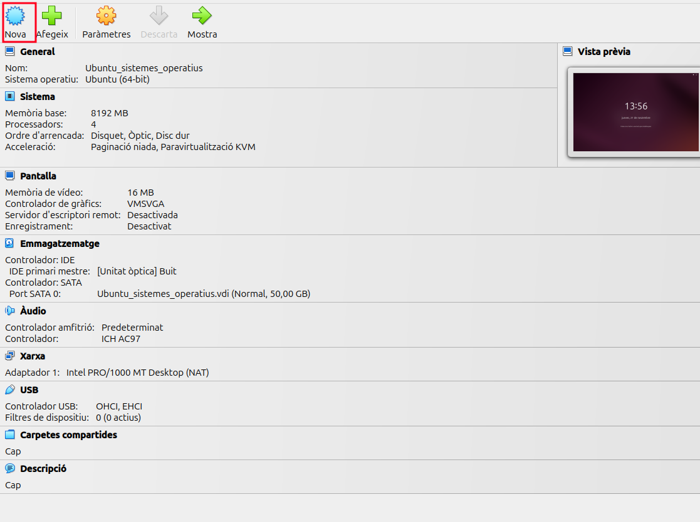 
despres asignarem la iso i farem unskipped instalation
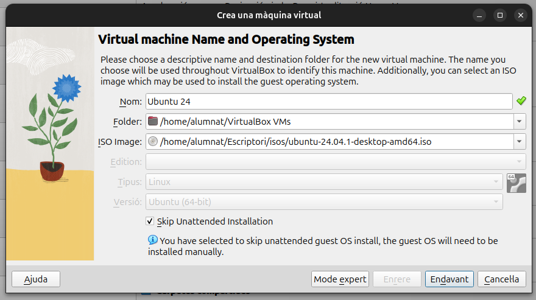  
Seguidament afegim la memoria i el processadors
  
Ara el que farem sera muntar un disk
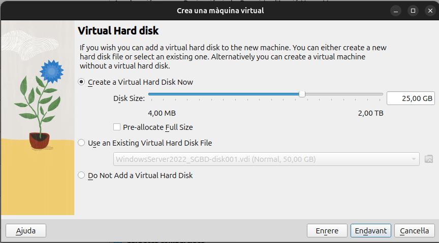   
Ara ja veurem el resum i podem engegar la maquina
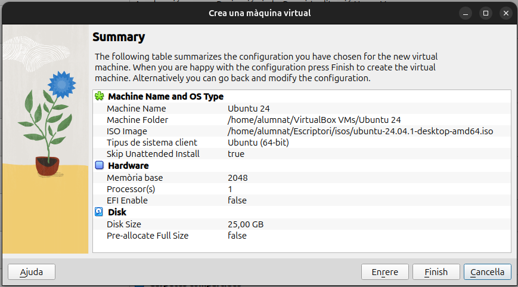 

Un cop dins de la maquina virtual, el primer que seleccionarem és que volem una instal·lació normal i les actualitzacions  
  
Afegirem les credencials per accedir posteriorment  
  
Seguidament l'idioma  
  
Li direm següent a les pròximes  
  

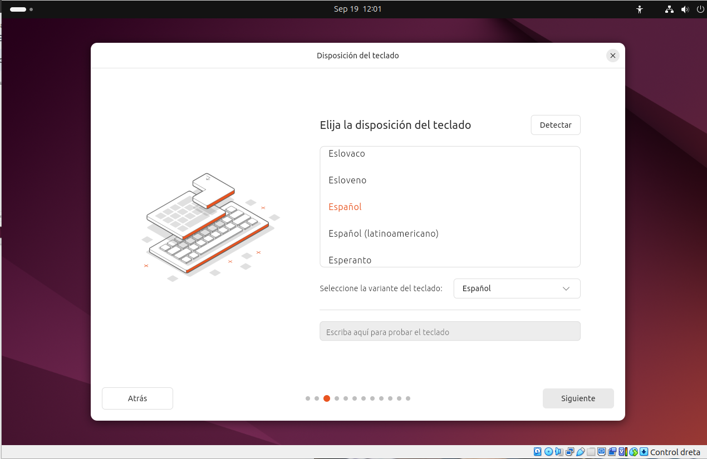

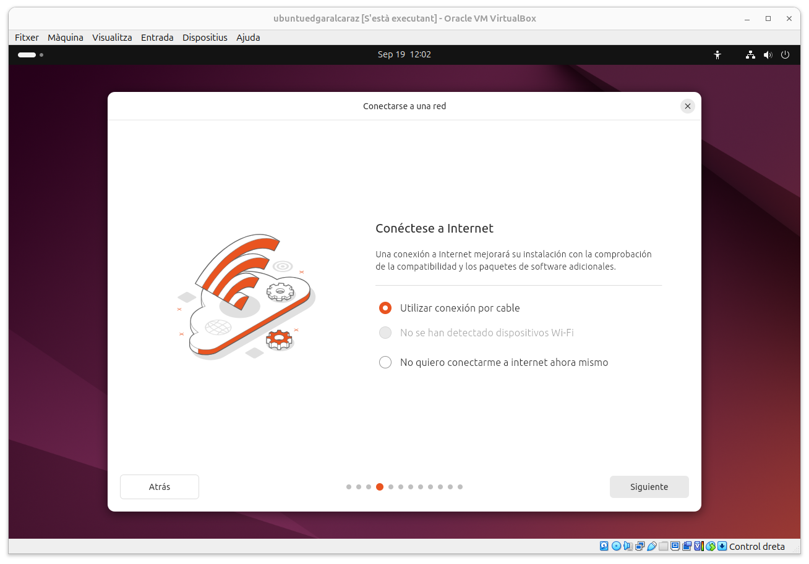

  
Fins aquí, seleccionarem l'opció d'instal·lar  
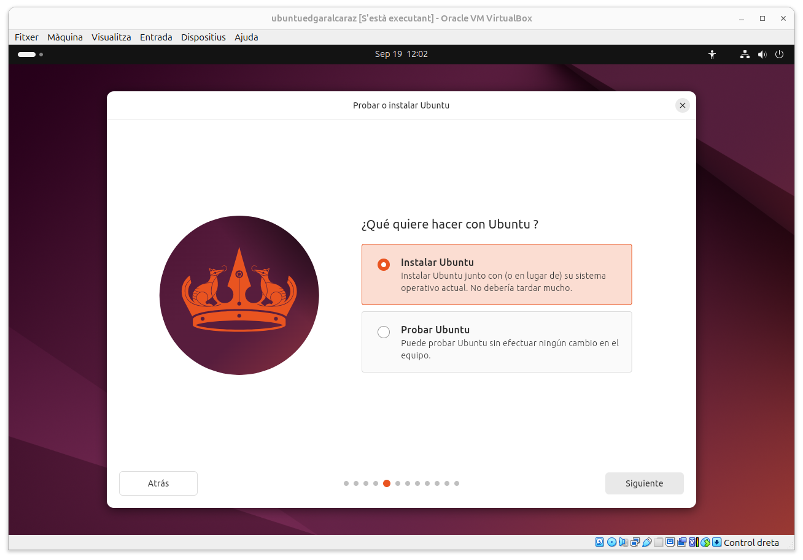  
Amb una instal·lació interactiva  
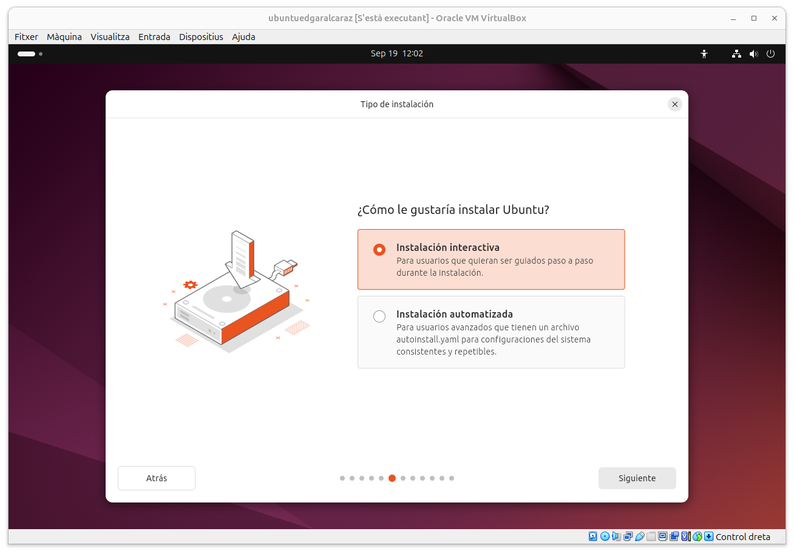  
Següent  
  
Següent  
  
Següent amb instal·lació manual  
  
Aquí crearem una partició de 10GB al swap  
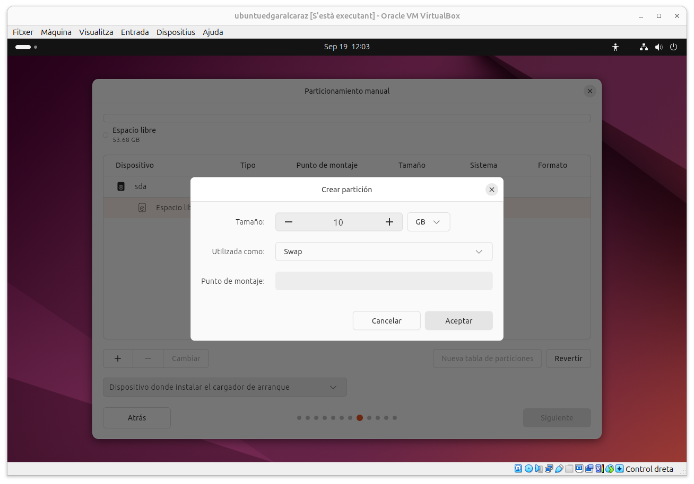  
Afegirem 37 GB de partició al directori home  
  
La resta d'espai per a la Ext4 a l'arrel  
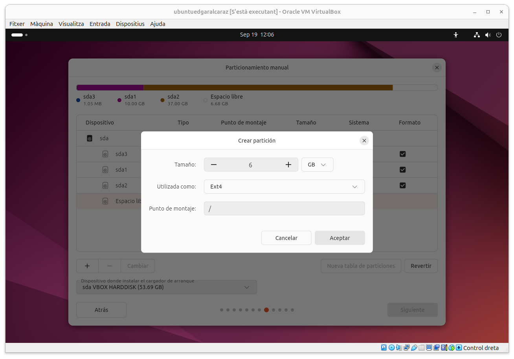  
Finalment queda així  
  
Següent  
  
I ja hauríem finalitzat la instal·lació, li direm finalitzar i comprovarem que podem entrar  
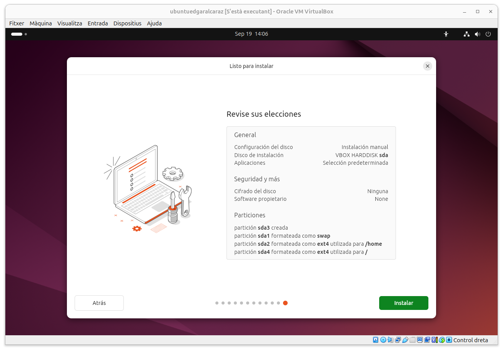  
Com es pot veure, ja podem accedir amb l'usuari creat prèviament  
  
