### 2. Punts de restauració

El primer pas serà tenir una màquina Ubuntu 24 Desktop on obrirem una terminal i farem la comanda `sudo apt install timeshift`, el qual ens instal·larà l'aplicació Timeshift  
  
Crearem una carpeta i un arxiu de text per a fer les comprovacions  
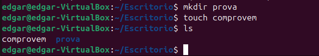  
Entrarem al Timeshift  
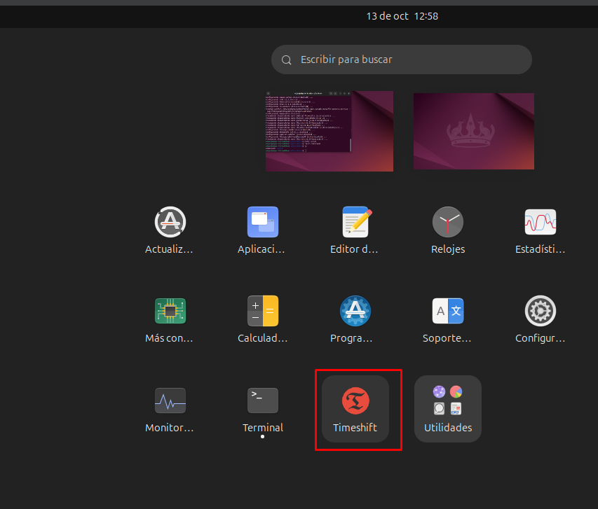  
Seleccionem la primera opció  
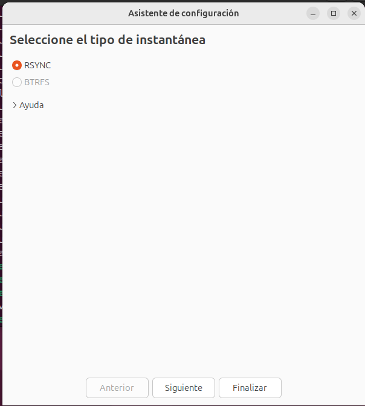  
Afegim la partició a la qual volem crear-li un punt de restauració  
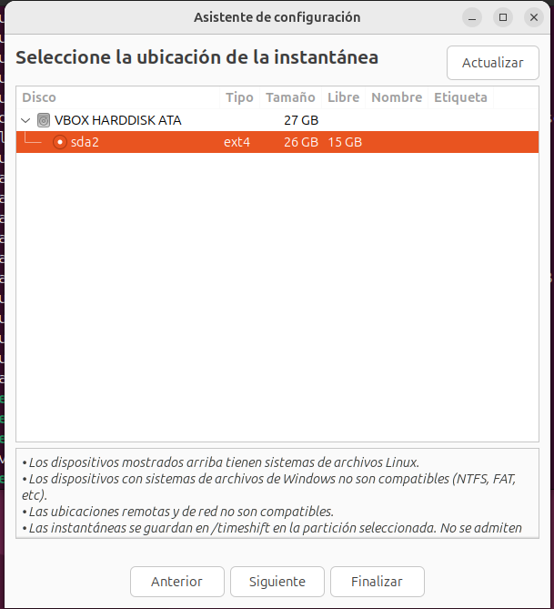  
Ens sortirà això per defecte i ho modificarem de la manera que necessitem  
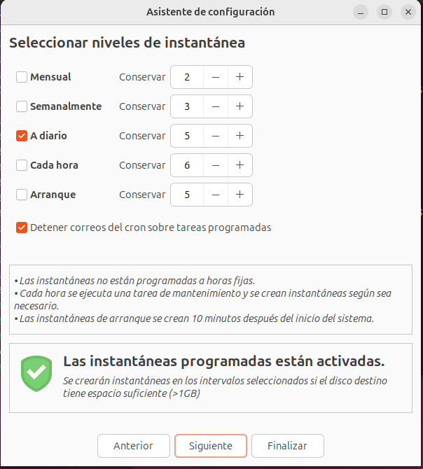  
Aquesta serà la nostra elecció  
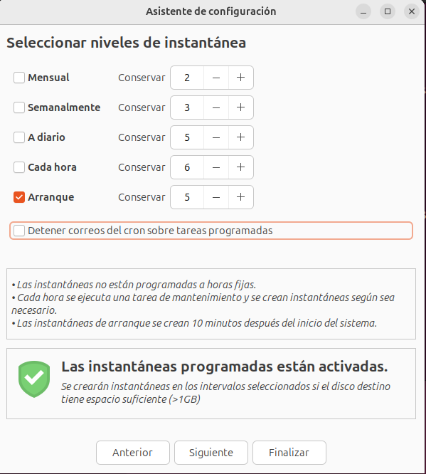  
Li direm que volem incloure tots els fitxers  
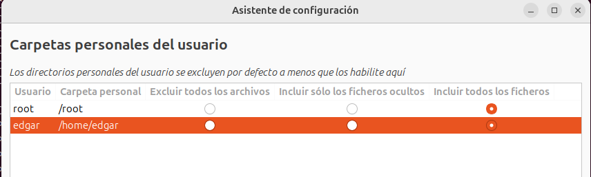  
Finalitzem  
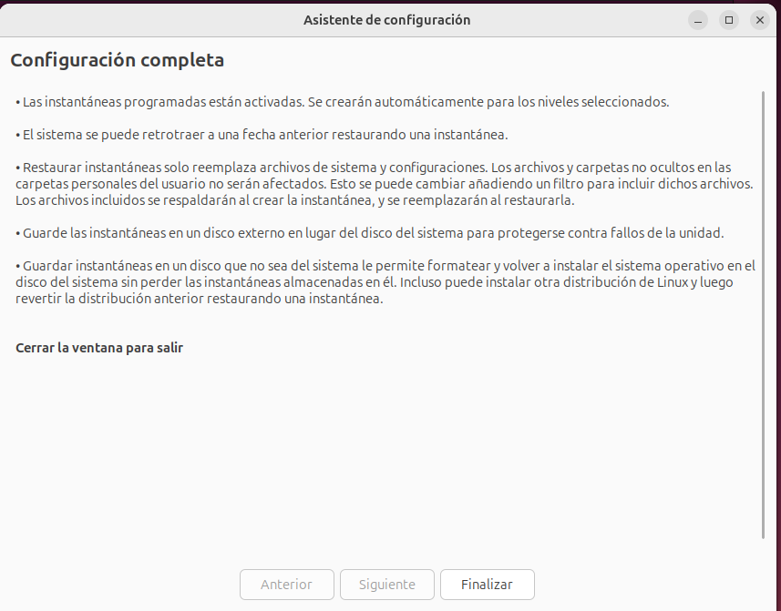  
Un cop fet això, li diem crear i que s'afegeixi el punt  
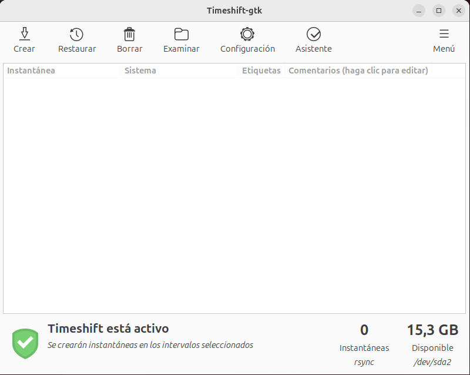  
Esborrem els arxius de prova  
  
A la que hem creat, li direm restaurar  
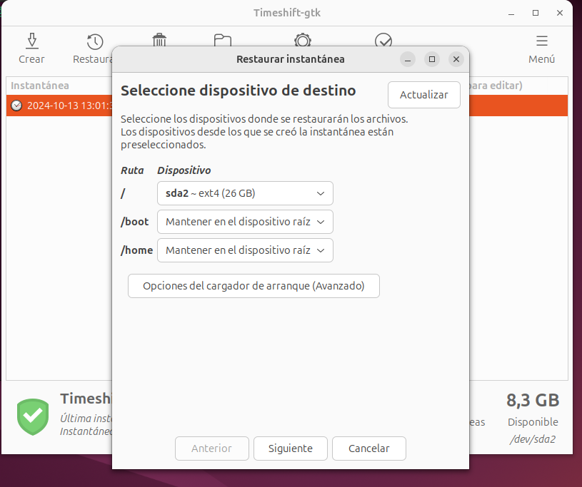  
Següent  
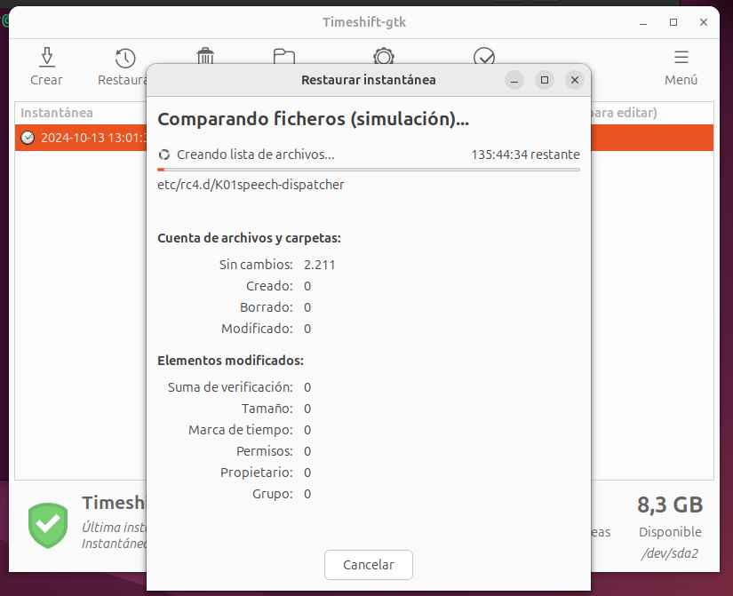  
Ens reinicia la màquina mentre fa el procés  
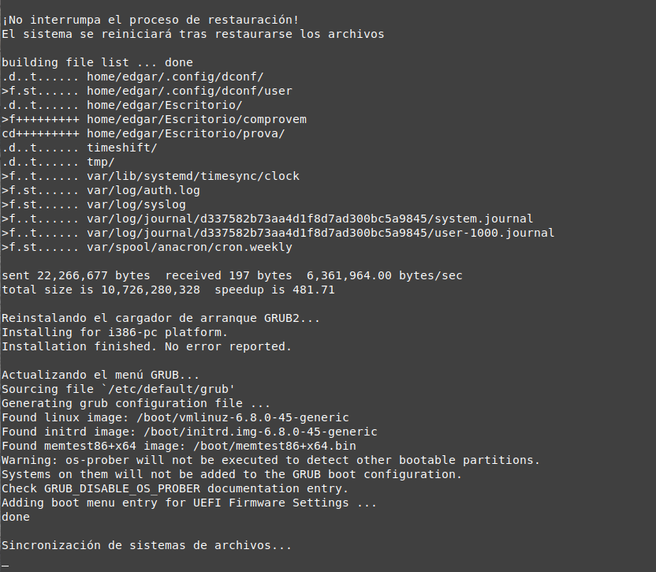  
Tornem a obrir la màquina, anem al directori i, com es veu, ja s'han recuperat els arxius  
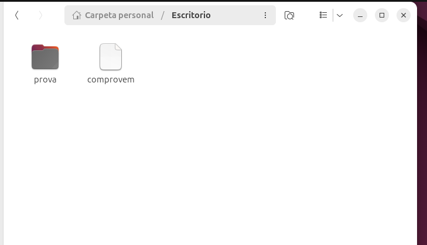  
