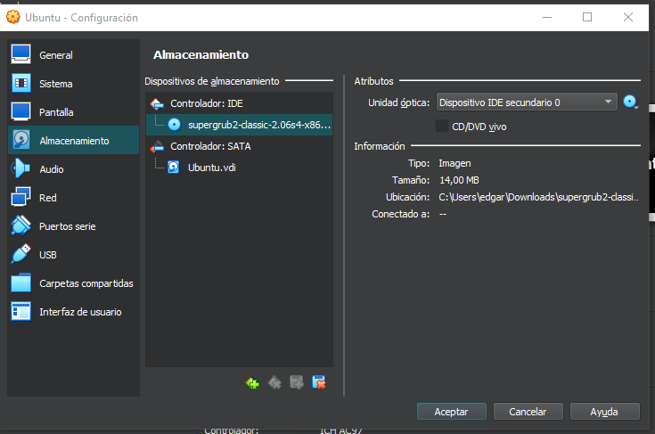
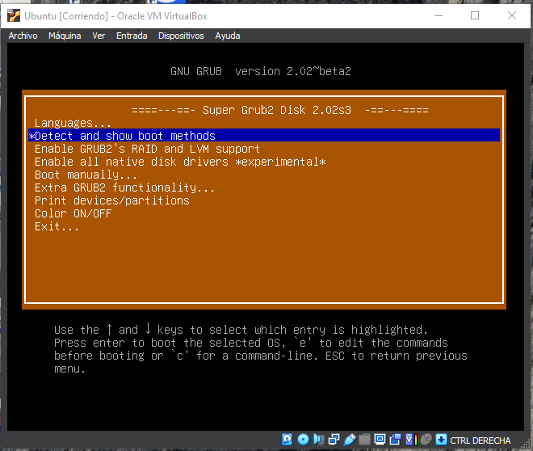
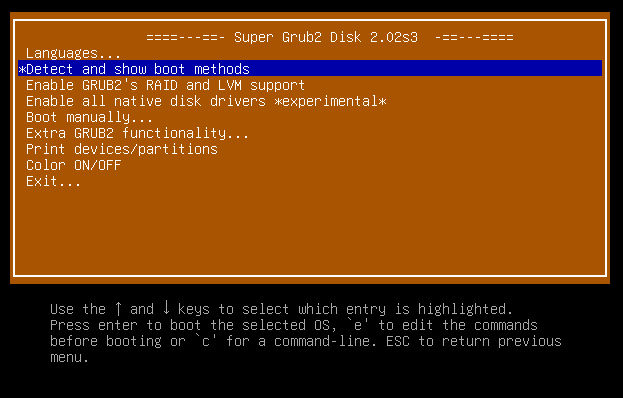
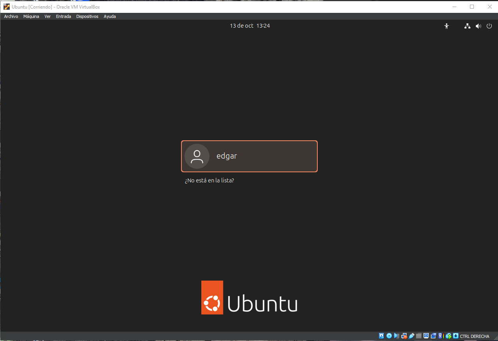
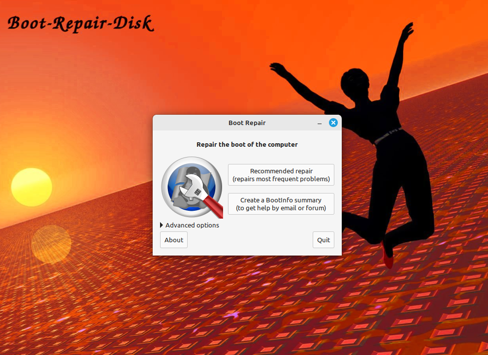

### 4. Gestors d’arrencada

El primer que hem de saber és que hi ha diverses maneres de recuperar el boot, la primera que provarem serà la de Grub2.

El primer pas d'aquesta serà esborrar el Grub amb la següent comanda  
  
Seguidament, reiniciarem la màquina i veurem que no es pot obrir  
  
Afegirem la ISO del Grub 2 a la màquina virtual  
  
S'obrirà amb el següent menú  
  
Seleccionarem la següent opció  
  
I d'aquestes, la primera  
  
Un cop fet això, ja podríem tornar a arrencar la màquina amb normalitat  
  

El següent mètode que provarem és el Boot Repair.

El primer pas d'aquesta serà esborrar el Grub amb la següent comanda  
  
Seguidament, reiniciarem la màquina i veurem que no es pot obrir  
  
Afegirem la ISO del Boot Repair a la màquina virtual  
  
Seleccionarem la primera opció  
  
I ja automàticament farà tot el procés  
  

  

  
Eliminarem la ISO i iniciarem la màquina  
  
Per últim, ja entrarem a la màquina de manera normal  
  
