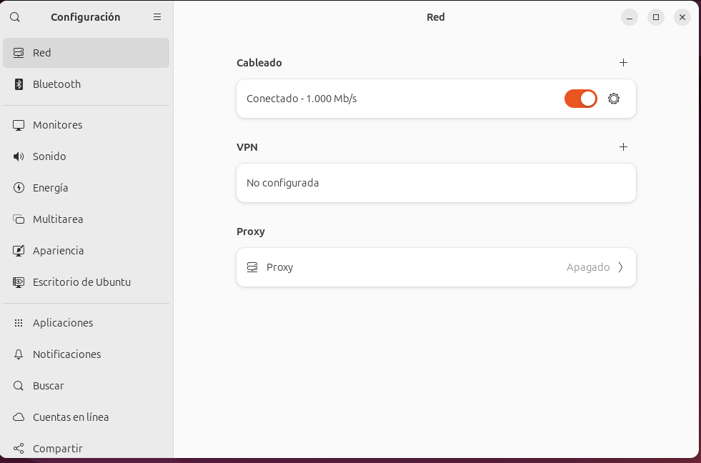
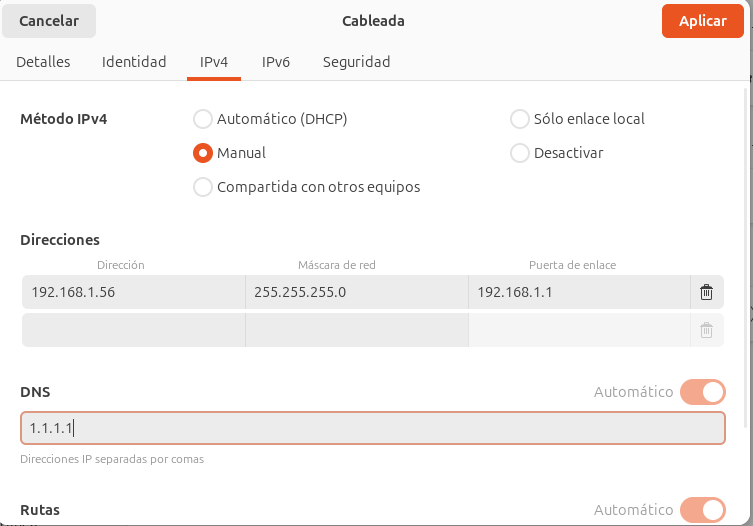
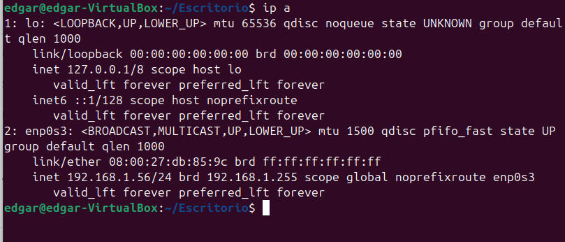
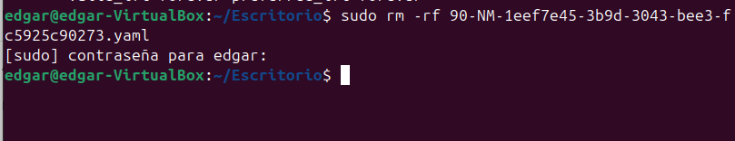
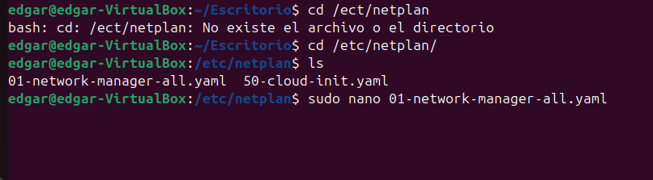
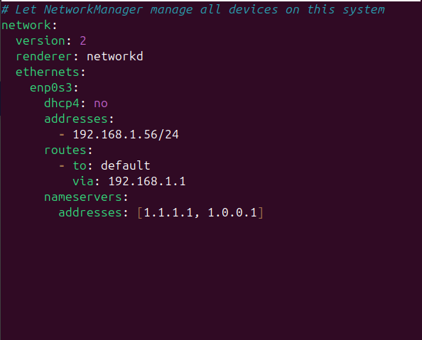
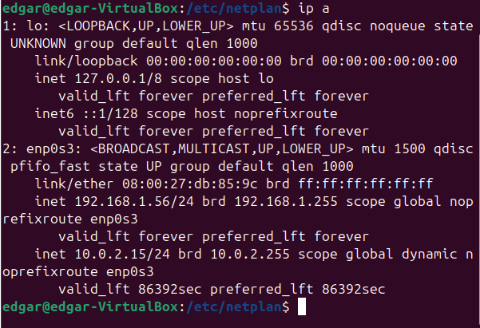

### [5. Configuració xarxa bàsica]

El primer pas és accedir a la configuració de xarxa d'una màquina  
  
Després, afegirem manual i ho canviarem  
  
Veurem amb l'IP a què s'ha canviat i ho farem també amb un altre mode  
  
Esborrarem el següent arxiu.  
  
Entrarem al directori on està la configuració de la xarxa, farem un `ls` per veure els arxius i obrirem amb un `sudo nano` l'arxiu de configuració  
  
Canviarem els paràmetres per afegir els següents que ens donaran servei  
  
Farem un `sudo netplan apply` i veurem com s'ha canviat la IP  
  
