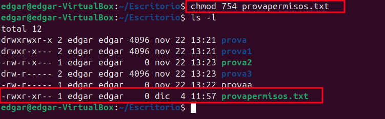

**1. Consoles virtuals i terminal nativa**
Accés a terminals virtuals
CTRL + F3: Obre una terminal nativa (TTY). És útil si l'entorn gràfic falla o necessites accedir al sistema directament.
CTRL + F2: Retorna al gestor d'inici de sessió (entorn gràfic). També pots alternar entre terminals virtuals amb les tecles F1 a F6.

**2. Fitxers del sistema relatius a usuaris i grups**

/etc/passwd:
Conté informació sobre els usuaris del sistema. Cada línia representa un usuari amb els camps següents:

Nom d'usuari: Identificador de l'usuari.
X: Indica que la contrasenya està encriptada a /etc/shadow.
UID: Identificador únic de l'usuari.
GID: Identificador del grup principal de l'usuari.
Home directory: Carpeta personal de l'usuari.
Shell: Terminal que utilitzarà l'usuari en iniciar sessió.
/etc/group:
Defineix els grups creats al sistema. Cada línia conté:

Nom del grup.
GID (Group ID).
Llista de membres: Usuaris assignats al grup.
/etc/shadow:
Conté contrasenyes encriptades i informació relacionada amb la seguretat dels usuaris. És accessible només per l'usuari root:

Contrasenya encriptada: Substitueix el camp "X" de /etc/passwd.
Últim canvi de contrasenya, temps mínim/màxim per a canvis, etc.
/etc/gshadow:
Similar a /etc/group, però per grups amb contrasenya. També mostra qui són els administradors del grup.

## Comandes per gestionar usuaris i grups**

**Crear un usuari**

Crea un usuari de manera més bàsica, sense demanar contrasenya ni crear el directori personal.

Afegeix un usuari amb informació completa: contrasenya, grups, directori personal, etc.

**Eliminar un usuari**
Esborra un usuari de manera més bàsica, sense altres accions associades.

**Informació sobre comandes per a usuaris**

**Crear un grup**

Crea un nou grup al sistema.

**Afegir un usuari a un grup**

Utilitza usermod per afegir un usuari a un grup.

Explicació d'opcions:

-a: Assegura que no es perden altres grups als quals pertany 
l'usuari.

-G: Especifica el grup al qual afegir l'usuari.

**Treure un usuari d’un grup**

Utilitza gpasswd per eliminar un usuari d’un grup.

**Canviar el grup principal d'un usuari**

## Gestió de Permisos**
Format de permisos a Linux

Els permisos es divideixen en tres grups:

Usuari (u): El propietari del fitxer.

Grup (g): Els usuaris que formen part del grup propietari.

Altres (o): Tots els altres usuaris.

Cada grup pot tenir tres tipus de permisos:

r: Lectura (4).

w: Escriptura (2).

x: Execució (1).

Els números octals representen combinacions d’aquests permisos:

0: Cap permís.

1: Execució.

2: Escriptura.

3: Escriptura i execució.

4: Lectura.

5: Lectura i execució.

6: Lectura i escriptura.

7: Tots els permisos (lectura, escriptura i execució).

**Chmod**

**chmod -R**

**sticky: chmod numero de permisos o o+t**

Creem la carpeta amb permisos 777 i l'sticky sera l'encarregat de fer que els usuaris no puguin borrar les creacions d'altres users

**suid: chmod numero de permisos o u+s**

Executa el fitxer amb els permisos del propietari.

**sgid: chmod numero de permisos o g+s**

Els nous fitxers creats dins heretaran el grup de la carpeta.

## Chown

**chown -R**

Canviar el propietari de forma recursiva:

## Chgrp

**chgrp -R**

Canviar grup propietari de forma recursiva:

## Acl

**getfacl**

Visualitzar ACL:

**setfacl -m user:permiso de la carpeta**

Afegir permisos ACL:

**setfactl -b**

Esborrar configuració ACL:

**setfacl -x usuario carpeta**

Eliminar permisos ACL:

## Umask

**Para poner un unmask ejecuta el comando:**

Defineix els permisos predeterminats per a fitxers i carpetes.
Exemple: 022 resulta en fitxers amb permisos 644 i carpetes 
amb permisos 755.

**umask numero**

