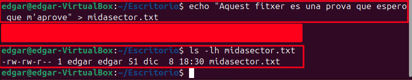
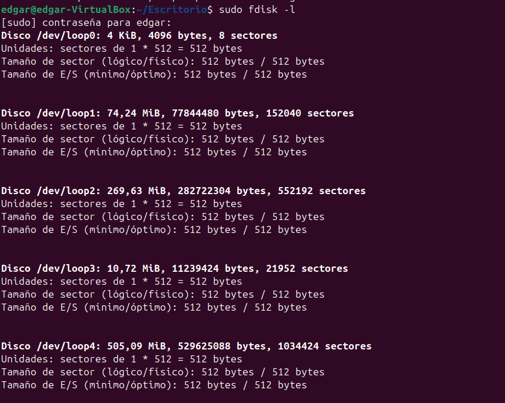
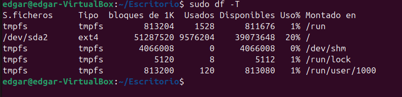
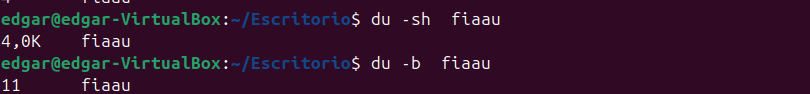
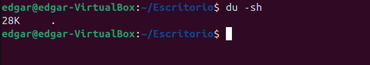

## 1. Sistemes de fitxers

Un sistema de fitxers defineix com es guarden, organitzen i accedeixen les dades en un dispositiu d'emmagatzematge.

Exemples comuns de sistemes de fitxers
FAT32:

Compatible amb la majoria de sistemes operatius.
Límit de mida per fitxer: 4 GB.
Ideal per dispositius USB o targetes SD.
Exemple: Un pendrive formatat en FAT32 podrà ser llegit tant en Windows com en macOS i Linux.
NTFS:

Utilitzat per Windows.
Suporta fitxers de mida molt gran i permet configuracions avançades com permisos d'accés.
Exemple: És l'elecció habitual per a discs interns o externs que només utilitzin Windows.
EXT4:

Utilitzat per Linux.
Eficient amb grans quantitats de dades i suporta fitxers de mida massiva.
Exemple: Les distribucions Linux utilitzen EXT4 per defecte per a particions del sistema.
APFS:

Utilitzat per macOS.
Optimitzat per a discs SSD.
Exemple: MacBooks moderns utilitzen APFS per gestionar el sistema i fitxers.
exFAT:

Compatible amb Windows i macOS.
Suporta fitxers grans sense límit com FAT32.
Exemple: Perfecte per a unitats USB grans utilitzades en diferents sistemes.

**Mida sector**

Creem un fitxer i comprovarem la mida 

ls -lh mostra la mida lògica (tallada).

**Mida Block**

**Fragmentació interna**

**Fragmentació externa**

## Tipus de formateig

**Formateig rapid**

Característiques:

Es pot fer desde el sistema opratiu

Només elimina el sistema de fitxers i les metadades.

No esborra físicament les dades; aquestes poden ser recuperables.

Ignora sectors defectuosos.

**Formateig mitja**

Característiques:

Es pot fer desde el sistema opratiu
Similar al ràpid, però verifica els sectors defectuosos i els marca com a "warnings", pero no els tracta de reparar.

Es pot fer amb format + c, i es borren etdades, formats...etc 

**Formateig baix nivell**

Intenta reparar sectors defectuosos i borra arxius.

S'utilitza cuan venen de fabrica i es necesita fer un formateig.

Només es pot fer amb eines de fabricants o maquinari específic, no des del sistema operatiu.

## Sistemes de fitxers**

**Creació de particions i formats**

## fdisk -l

El sector aes la unidad minima fisica on se guarden les dades en un disc

Per defecte es 512, esta mesurat en bytes, i no es pot canviar mai
Indiferentment si es mecanic o solid

## DF -T

Mostra les particiosns i sistemes de fitxers

## du -b
Mostra el que ocupa el arxiu

## du -sh 

mostra el que oocupa en el disc

## Bloc
 Un bloc es la unitat predeterminada, es el tamany predefinit en el que treballa el disc dur

## Fragmentacio

La fragmentacio interna es tot aquell espai que queda desaprofitat en els blocs

CUan es redueix el bloc no desaprofites espai pero empitjora el rendiment

Podem aumentar el rendiment pero l'esai quedaria desaprofitat

El problema es q es van utilitzar blocs aleatoris que fan empitjorar el rendiment, la solucio es fer una desfragmentacio externa

En windows cada cet temps automaticament es desfragmenta

