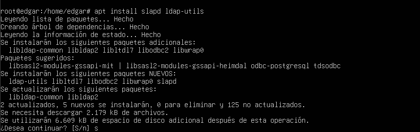

**Instal·lació domini LDAP**

Un domini LDAP (Lightweight Directory Access Protocol) és una estructura organitzativa jeràrquica utilitzada per administrar i gestionar informació sobre usuaris, grups, recursos i altres elements dins d’una xarxa. Actua com un repositori centralitzat per a l’autenticació i el control d’accés, permetent que diferents sistemes i aplicacions comparteixin informació sobre usuaris i permisos.

Dins d’un directori LDAP, les Unitats Organitzatives (UO) serveixen com a contenidors per estructurar usuaris, grups i altres objectes de manera més ordenada. Aquestes UO permeten una administració més eficient, ja que poden agrupar-se segons criteris com departaments, ubicacions o rols dins de l’organització.

Per posar en marxa un domini LDAP, seguirem els passos següents:

**Configuració inicial**

El primer que cal fer és comprovar la IP del servidor. En aquest cas, la configurarem manualment i verificarem la seva connectivitat fent un ping.

A continuació, modificarem el nom de la màquina host. Per fer-ho, editarem el fitxer etc/hostname i també farem els canvis corresponents al fitxer etc/hosts. 

**Instal·lació del servei LDAP**

Si no tenim instal·lat el paquet slapd, el descarregarem i executarem. Pot ser que durant la configuració apareguin alguns errors. En cas que sigui així, podem tornar a reconfigurar el paquet utilitzant la següent comanda:

Instal·lació de slapd

dpkg-reconfigure slapd

Quan s’executa la reconfiguració, apareix un menú de configuració en què haurem d’introduir diferents valors. És important eliminar la base de dades prèvia per evitar problemes.

Durant aquest procés, establirem una contrasenya i definirem els noms de domini necessaris.

**Configuració de les Unitats Organitzatives, grups i usuaris**

Ara definirem les UO, grups i usuaris dins del directori LDAP. És essencial verificar que els noms de domini coincideixin amb els configurats anteriorment per evitar errors.

Com es pot apreciar els valors coincideixen amb els de la configuració prèvia. Per continuar ara configurarem les "ou", grups i usuaris tal i com es mostra, també es veurà com aplicar els canvis al LDAP.
Es important que als arxius es tingui en compte els noms de domini que hem configurat ja que podria ser una font d'errors. Creació de les UO

Editem l’arxiu ou.ldif per afegir les unitats organitzatives:

Especificarem els grups dins de l’arxiu group.ldif

Afegirem els usuaris al fitxer usu.ldif:

Com que aquests fitxers han estat creats manualment, hem d’afegir-los al servidor LDAP amb la següent comanda:

Per comprovar que els canvis s’han aplicat correctament, tornem a utilitzar la comanda slapcat:

**Instal·lació del domini LDAP en un servidor Ubuntu Server**
A l'apartat anterior hem detallat com configurar un domini LDAP en una màquina Ubuntu amb interfície gràfica. En aquesta secció, explicarem com dur a terme la instal·lació directament en un servidor Ubuntu sense interfície gràfica. Seguirem els mateixos passos fins a la configuració dels paquets, moment en què destacarem les diferències d’aquest procés sense entorn gràfic.

El primer pas consisteix a configurar la xarxa del servidor. Per fer-ho, hem de modificar un fitxer de Netplan on ajustarem la nostra adreça IP.

sudo nano /etc/netplan/50-cloud-init.yaml

Un cop realitzats els canvis, cal aplicar la configuració i verificar que s’ha aplicat correctament.

Després de configurar la xarxa, cal modificar els fitxers de hosts i hostname ubicats al directori /etc/.

Finalment, procedim a la instal·lació del paquet LDAP. A partir d’aquest punt, seguirem els mateixos passos descrits anteriorment, ja que el procediment és idèntic.

apt install slapd ldap-utils
