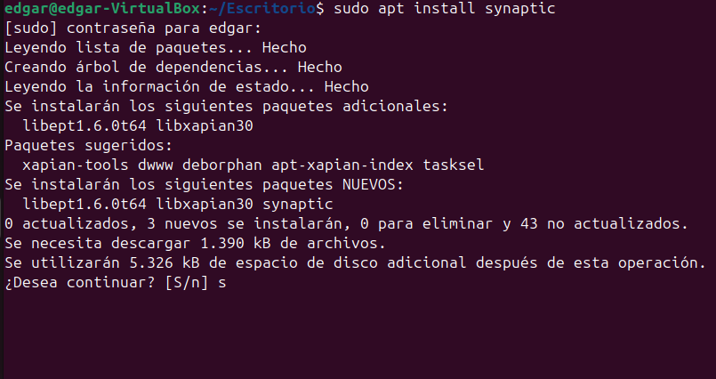
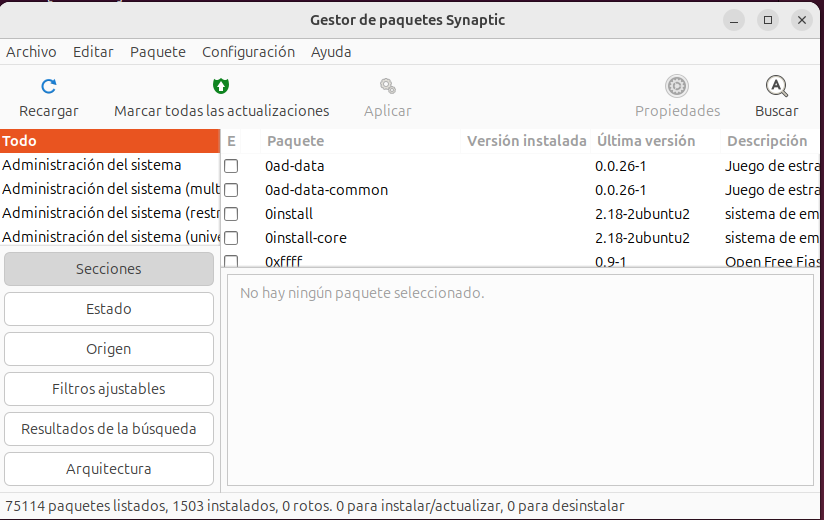

### Instal·lacions de programari

Per a fer intalacions de programaria a linux el metode a emprar és ulització de comandis com els següents

Instal·lar paquets:
suo apt-*get install nom_de el_paquet

Eliminar paquets:
suo apt-*get remove nom_de el_paquet

Buscar paquets:
apt-*cache search paraula_*clau

Obtenir llistes actualitzades dels paquets disponibles:
suo apt-*get update

Modernitzar el seu sistema amb les actualitzacions disponibles:
suo apt-*get dist-*upgrade

Veure més comandos i opcions:
apt-*get help

També existeix la eina synaptic que es molt senzilla d'instal·lar i ens pot ajudar

